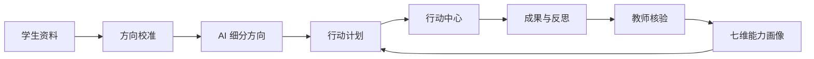
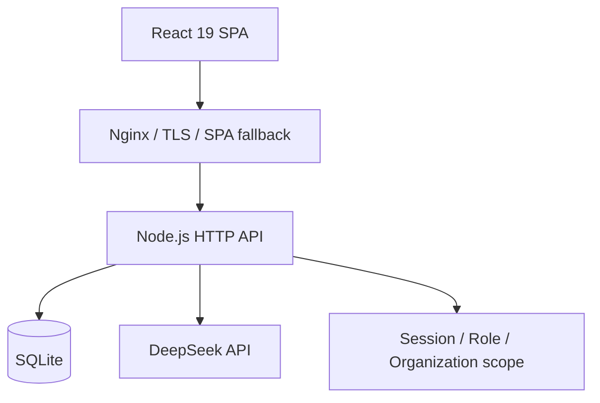

# 向前 | Career Navigation

面向高校生涯教育场景的全栈 Web 应用。系统把方向判断、培养方案、行动执行、成果核验和能力画像连接到同一账号，让学生按阶段推进计划，也让教师基于真实参与记录提供反馈。

[在线访问](https://139.199.69.46/career/) · 当前发布版本 `v0.7.2`

## 产品流程



### 分阶段工作区

| 使用者 | 工作流 | 核心输出 |
| --- | --- | --- |
| 低年级学生 | 首次方向校准 → DeepSeek 细分 → AI 行动计划 | 可调整的方向画像、唯一主线计划 |
| 高年级学生 | 目标路径 → 岗位能力差距 → 学期行动 | 就业、推免、考研、考公路线 |
| 研究生 | 科研成果 → 能力证据 → 职业准备 | 科研与职业双线计划 |
| 教师与学院 | 资源发布 → 成果审核 → 匿名洞察 | 核验记录、参与漏斗、培养分析 |

方向校准保存兴趣、价值偏好、动机、问题场景和宽方向。学生可以在 AI 规划页或个人资料页重新校准；系统保留既有行动、完成状态、反思、成果证据和教师反馈，并提示使用新画像更新计划。

## 核心能力

### 培养方案驱动的学习路径

- 导入 UTF-8 CSV、JSON、TXT 或 Markdown 培养方案。
- 解析课程名称、学期、学分、课程性质、修读状态和成绩。
- 结合年级、绩点、专业排名、每周投入和升学偏好生成学习拓扑。
- 内置算法工程师路线，覆盖数学基础、机器学习、深度学习、PyTorch、论文复现、科研产出和项目作品。
- 每个节点包含前置课程、执行步骤、建议周期、完成标准和可访问的学习资源。
- 近期学习节点可以写入行动中心，继续使用成果、反思和教师核验流程。

绩点与排名用于生成规划建议。系统把校内正式政策和平台启发式建议分开呈现，并在排名信息缺省时采用考研与推免双线方案。

### 行动与证据闭环

- 行动中心统一管理 AI 主线、保留补充、手动任务和校内资源行动。
- 每项行动包含优先级、建议投入、执行步骤、完成标准、截止日期和证据要求。
- 学生可以提交文字成果、反思和 HTTPS 公开链接。
- 教师使用匿名编号审核成果，按 0–4 级表现和 1–3 权重记录核验结果。
- 通知覆盖截止前 7/3/1 天、成果退回和核验完成；已加入资源可以导出 `.ics` 日历。

### 七维能力画像

系统使用七个稳定维度：

1. 沟通协作
2. 创新思维
3. 专业技能
4. 数字素养
5. 责任担当
6. 持续学习
7. 心理韧性

画像分别保存学生自评、教师核验证据分和证据可信度。有核验证据的维度按 `35% 自评 + 65% 核验证据` 合成；可信度结合证据数量、来源类型和时间范围计算。

### 校内资源与学院工作台

- 资源状态覆盖草稿、审核、发布、关闭和归档。
- 发布信息包含官方来源、责任单位、适用范围、报名方式、成果要求和关联能力。
- 学生参与状态覆盖收藏、确认报名、进行中、成果提交、退回补充、完成核验和撤回。
- 学院洞察使用累计参与漏斗，并对小样本分组应用隐私阈值。
- 组织成员使用 `student`、`publisher`、`reviewer`、`career_admin` 权限模型。

## AI 使用边界

DeepSeek 负责候选方向比较、规划解释和行动拆解。能力评分由规则、学生自评和教师核验证据计算。

系统记录模型名、提示词版本、规则版本、生成时间、资源引用和校准版本，便于复现规划结果。方向画像属于账号内的规划上下文，用于生成当次建议；系统不会把学生数据标记为模型训练或微调样本。

DeepSeek 服务采用服务端调用。浏览器、仓库、日志和本地持久化均不接触 API 密钥。规则规划、行动管理、资源参与和成果核验可以独立运行。

## 技术架构



| 层级 | 技术 |
| --- | --- |
| 前端 | React 19、TypeScript 5、Vite 7、React Router、Zustand |
| 交互与可视化 | Framer Motion、Recharts、Lucide React、SVG 学习拓扑 |
| 服务端 | Node.js ESM HTTP 服务 |
| 数据库 | SQLite、`better-sqlite3`、版本化 schema migration |
| 测试 | Vitest、Testing Library、Playwright |
| 部署 | Docker Compose、Nginx、systemd、原子 release 目录 |

### 数据所有权

- SQLite 保存账号、资料、服务端权威行动、资源参与、证据、审核、通知和审计记录。
- `career_states` 保存方向画像、AI 规划上下文、培养方案、学习路径和研究生双线计划。
- 浏览器按账号保存本地快照，并在短暂防抖后同步到服务端。
- 恢复顺序优先保护本机待同步修改，再读取服务端和账号本地快照。

## 本地开发

### 环境要求

- Node.js 20+
- npm 10+

安装依赖：

```bash
npm ci
```

分别启动 API 与前端开发服务器：

```bash
npm run dev:api
```

```bash
npm run dev
```

- Web：`http://127.0.0.1:5173/`
- API：`http://127.0.0.1:8787/`
- Health：`http://127.0.0.1:8787/healthz`

在 Windows 上连接 DeepSeek：

```powershell
.\scripts\start-local-ai.ps1
```

脚本从安全输入读取密钥，并把密钥限制在 API 子进程环境中。

## 运行时配置

以 [.env.example](./.env.example) 为配置模板：

| 变量 | 用途 | 默认值 |
| --- | --- | --- |
| `PORT` | API 监听端口 | `8787` |
| `DATABASE_PATH` | SQLite 文件路径 | `data/career.db` |
| `DEEPSEEK_API_KEY` | DeepSeek 服务端密钥 | 空 |
| `DEEPSEEK_MODEL` | 规划模型 | `deepseek-v4-flash` |
| `DEEPSEEK_BASE_URL` | DeepSeek API 地址 | `https://api.deepseek.com` |
| `COOKIE_SECURE` | HTTPS Cookie 标记 | `false` |
| `REGISTRATION_MODE` | `open` 或 `invite` 注册模式 | 生产环境使用 `invite` |
| `CAREER_INVITED_EMAILS` | 受邀学生邮箱，逗号分隔 | 空 |
| `CAREER_TEACHER_EMAILS` | 教师账号邮箱，逗号分隔 | 空 |
| `IDENTITY_PROVIDER` | 身份适配器标识 | `local` |

生产密钥只放在运行时环境或受权限保护的环境文件中。

## 常用命令

| 命令 | 作用 |
| --- | --- |
| `npm run dev` | 启动 Vite 开发服务器 |
| `npm run dev:api` | 启动 Node API |
| `npm run typecheck` | 执行 TypeScript 类型检查 |
| `npm run lint` | 执行 ESLint |
| `npm run test` | 运行 Vitest |
| `npm run test:e2e` | 运行 Playwright 端到端测试 |
| `npm run test:visual` | 运行视觉与响应式审计 |
| `npm run audit` | 审计生产依赖 |
| `npm run check:release` | 执行完整发布门禁 |

发布门禁依次检查服务端语法、TypeScript、ESLint、Vitest、Playwright、视觉场景、生产构建和依赖。浏览器测试使用隔离 API 进程、端口和临时 SQLite 数据库。

## 部署

### Docker Compose

```bash
cp .env.example .env
docker compose up --build -d
curl http://127.0.0.1:8080/healthz
docker compose exec api wget -qO- http://127.0.0.1:8787/healthz
```

Compose 提供只读容器文件系统、`no-new-privileges`、API 健康检查和 SQLite 命名卷。

### `/career/` 子路径构建

PowerShell：

```powershell
$env:VITE_APP_BASE = '/career/'
$env:VITE_API_BASE = '/career/api'
npx vite build --mode tencent
```

Bash：

```bash
VITE_APP_BASE=/career/ \
VITE_API_BASE=/career/api \
npx vite build --mode tencent
```

生产发布包以 `dist/` 作为 `public/`，并包含 `server/`、`package.json`、`package-lock.json` 和 Linux 生产依赖。`deploy/tencent/deploy-release.sh` 创建数据库一致性备份、验证 schema 与健康接口、原子切换 `current`，并保留上一 release 作为回滚点。

## API 概览

### 账号与规划

- `POST /api/auth/register|login|logout`
- `GET /api/auth/session`
- `GET|PATCH /api/me/profile`
- `GET|PUT /api/me/career-state`
- `POST /api/planning/directions`
- `POST /api/planning/actions`

### 学生行动

- `GET /api/me/dashboard`
- `GET|PATCH /api/me/ability-profile`
- `GET|POST /api/me/actions`
- `PATCH /api/me/actions/:id`
- `POST /api/me/actions/reconcile`
- `POST /api/me/evidence`
- `GET|PATCH /api/me/notifications`
- `GET /api/me/calendar.ics`
- `GET /api/opportunities`
- `POST /api/opportunities/:id/participation`

### 教师与学院

- `GET|POST|PATCH /api/staff/opportunities`
- `POST /api/staff/opportunities/:id/submit|review|status`
- `GET /api/staff/evidence`
- `POST /api/staff/evidence/:id/review`
- `GET /api/staff/insights`

## 项目结构

```text
.
├── deploy/                  # 腾讯云配置与原子发布脚本
├── docs/                    # 产品规格、设计与实施记录
├── e2e/                     # Playwright 端到端测试
├── nginx/                   # 容器 Nginx 配置
├── scripts/                 # 发布审计与本地 AI 启动脚本
├── server/                  # Node API、SQLite schema 与服务测试
├── src/
│   ├── components/          # 通用组件与产品组件
│   ├── data/                # 方向、岗位与课程资源数据
│   ├── pages/               # 学生、研究生、教师与账号页面
│   ├── services/            # 推荐、规划、同步与 API 客户端
│   ├── store/               # Zustand 账号规划状态
│   └── styles/              # 设计令牌与响应式样式
├── compose.yml
├── Dockerfile
└── vite.config.ts
```

## 设计与可访问性

界面使用暖米白、纸张白、深棕黑和陶土橙，结合清晰留白、编辑式排版和渐进披露。响应式规则覆盖桌面、平板、390px 与 360px 手机、深色主题、减少动效、减少透明度和 200% 页面缩放。

交互组件提供 44px 触控区域、可见焦点、键盘导航、语义化表单和跳转到主内容入口。
